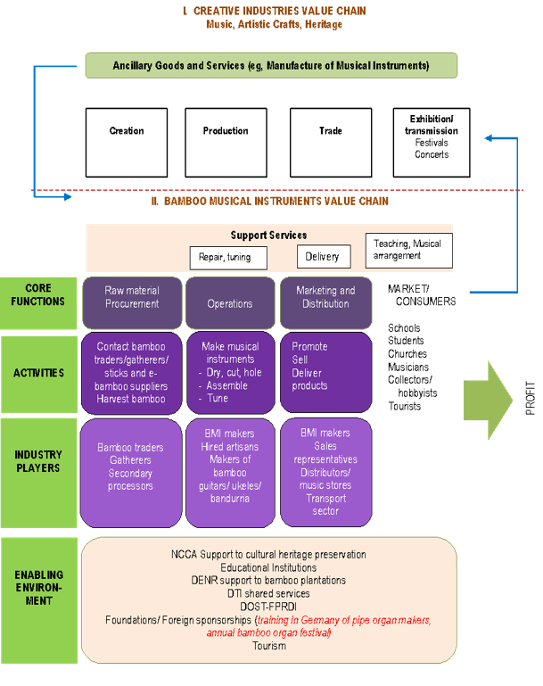

# Deep-Dive Value Chain Analysis (VCA) of the Philippine Bamboo Musical Instruments (BMI) Industry

*A Socioeconomic and Operational Mapping of Craftsmanship, Culture, and Commerce*

---

## Executive Summary
This document provides an unshortened, comprehensive analysis of the socioeconomic and operational landscape of the **Bamboo Musical Instruments (BMI)** industry in the Philippines [41]. Conducted under the **Bamboo Musical Instruments Innovation R&D Program** of the **DOST-Forest Products Research and Development Institute (DOST-FPRDI)** [66], this diagnostic maps the pathways of raw materials, capital, information, and labor from the bamboo forests to the final consumer [41, 58]. 

By analyzing the actors, support services, and the broader business enabling environment [41], this study identifies critical industry bottlenecks and highlights the pathways through which scientific R&D—such as advanced seasoning, thermal modification, and computer-aided prototyping—can empower local craftsmen, integrate indigenous traditions, and boost competitiveness in both domestic and international markets [44, 56, 61, 66].

---

## 1. Introduction: BMIs in the Creative and Cultural Industries

The manufacture of musical instruments in the Philippines is much more than a fabrication process; it is a highly specialized, artisanal craft [41]. Within the global framework of the creative and cultural economy, the production of bamboo musical instruments (BMIs) is classified as an **ancillary service** to three key sectors [41]:
1. **Cultural Heritage** [41, 62]
2. **Artistic Crafts** [41, 63]
3. **Performing Arts / Music** [41, 52]

These sectors represent three of the nine core sub-sectors of the creative and cultural industries identified globally by **UNESCO** (de Voldere 2017) [41]. 

### The Nature of an Ancillary Service
As an ancillary service, the manufacture and supply of BMIs act as structural pillars that support and facilitate the core creative chain rather than being a standalone, isolated creative activity [41]. For example, the creation of a high-quality, tuned bamboo instrument directly enables a musician to perform, a theater group to stage a play, or a school to preserve indigenous music [15, 53]. 

### The "Short-Chain" Structural Characteristic
Unlike heavy manufacturing sectors with highly fragmented, globally distributed divisions of labor, the BMI value chain is characterized by its **short, highly integrated structure** [41, 46]. In most local BMI enterprises, a single individual—typically the **shop owner or master craftsman**—performs several overlapping activities across the entire value chain [41, 46]:
* **Procurement:** Personally selecting and harvesting mature bamboo poles [42].
* **Production:** Executing mechanical processing, carving, assembly, and manual ear-tuning [46, 47].
* **Marketing & Sales:** Handling negotiations, direct peddling, online marketing, and customer relations [48, 49].

While this short-chain model allows for exquisite artistic control, it presents severe challenges in scaling production, maintaining consistent standards, and mitigating raw material bottlenecks [44, 46].

---

## 2. Core Functions of the BMI Value Chain

The core operational flow of the BMI industry is divided into three primary sequential functions: **Raw Material Procurement**, **Production / BMI Making**, and **Marketing and Distribution** [42, 45, 48].

### A. Raw Material Procurement and Sourcing
Sourcing the correct raw material is the critical first gate of the entire value chain [42]. Because of the physical and acoustic diversity of bamboo, different musical instruments require highly specific species, wall thicknesses, and diameters [16, 42]:

#### Species-Specific Material Requirements:
1. ***Schizostachyum lumampao* (Blanco) Merr.**: Characterized by thin walls and exceptionally long internodes [16]. This physical structure provides a natural sound resonating through its cavity, making it the ideal raw material for thin-walled percussion instruments such as pipes, tubes, and buzzers [16].
2. ***Dendrocalamus asper* (Schultes f.) Backer ex Heyne (Giant Bamboo)**: Features thick, robust walls and a fibrous skin [16]. These physical properties are excellent for stringed bamboo musical instruments like zithers, and provide the structural density needed for carved slit drums [16].
3. ***Schizostachyum lima* (Blanco) Merr.**: Known for its narrow, small diameter, making it the preferred species for delicate wind instruments like flutes [16].


*Figure 1: High-quality botanical identification of local bamboo species is essential to match raw materials with their acoustic applications [17].*

#### Harvesting Pathways and Actor Groups:
The procurement function is divided into two distinct socio-technical pathways based on the background of the instrument maker:

##### 1. Indigenous (IP) Makers and Traditional Harvesting
Most makers of traditional or indigenous BMIs belong to **Indigenous Peoples (IP) communities** [42]. They gather wild bamboo poles themselves from local forests, following traditional cultural practices that inherently ensure quality control [42]:
* **Maturity Selection:** They personally select only mature, stable poles [42].
* **Seasonal Harvesting:** Cutting is strictly restricted to certain months of the year based on ancestral observations, which they claim makes the poles significantly less prone to natural biodeterioration and pest attacks [42].
* **Site Camping:** Artisans commonly camp on-site in the forests for one to two weeks to maximize the efficiency of each harvesting trip [42].
* **Regulatory Compliance:** Indigenous makers adhere to local community protocols and acquire all necessary government permits to gather forest resources legally [42].

##### 2. Commercial Makers and Suppliers/Traders
Makers producing non-indigenous, commercialized instruments (such as Western-style flutes, angklungs, or marimbas) typically procure their poles from trusted **suppliers, gatherers, or timber traders** [43]. 
* **Supplier Flexibility:** The relationship is built on the supplier's willingness to customize orders—such as pre-cutting poles to specified lengths or pre-processing raw bamboo into specific parts [43]. 
* **Secondary Processing:** To shorten their own manufacturing time, commercial makers often order pre-processed parts, such as bamboo sticks of varying sizes used for angklung frames, from specialized secondary processors [43].
* **Luthiery Sourcing and Lamination:** Luthiers who craft high-end stringed instruments (guitars, ukuleles, and bandurrias) require flat, structurally uniform sheets rather than hollow poles [44]. They buy **laminated bamboo panels** or engineered bamboo slats from secondary processors [44]. 
* **The Import Bottleneck:** Because the acoustic performance of a stringed instrument is highly sensitive to the bonding and density of the panel [44], luthiers demand flawless quality. Due to technical limitations and inconsistent quality among local e-bamboo suppliers, some local luthiers have been forced to bypass local markets and import engineered bamboo panels directly from China [44].

---

### B. Production and Artisanal BMI Making
The production stage represents the core value-adding function where raw agricultural forest products are transformed into musical tools [45, 46].

#### The Highly Skilled Workforce
BMI makers and artisans are classified as a **highly skilled workforce** [45]. The crafting of traditional bamboo instruments in IP communities is deeply tied to rituals, oral histories, and community celebrations, with the technical skills passed down as sacred heritage from generation to generation [45]. The growing market demand outside these communities has created sustainable livelihood opportunities for both indigenous groups and commercial, non-IP craftsmen who have adopted these techniques [45].

#### Operational Mechanics of the Artisanal Shop
In the Philippines, BMI manufacturing remains strictly **artisanal** [46]. The vast majority of enterprises are micro-sized shops where the owner is the head craftsman, directing all operations and executing the most sensitive steps [46].
* **Tooling:** Production relies heavily on manual hand-tools combined with basic power tools [46]. Standard equipment includes bolos, knives, specialized chisels, rip saws, clamp bars, hand-sanders, rubber mallets, blow torches for heat-straightening, and power drills [46].
* **Non-Standardized Layouts:** Traditional instrument making does not follow standardized mathematical templates [46]. For instance, the placement and distance between finger holes on traditional flutes are frequently measured using the width of the artisan’s own fingers (e.g., "two or three fingers") [46]. This results in unique, highly personalized instruments but presents significant challenges for acoustic uniformity [46].
* **Labor Structure:** Most micro-shops operate on a **per-order basis** [46]. To control overhead costs, the owner typically operates alone or with family, hiring an additional 1 to 3 workers temporarily when large purchase orders are secured [46]. A major exception is the specialized team of the **Las Piñas Bamboo Organ builder**, which employs a permanent, structured team of more than ten specialized workers per restoration project [46].


*Figure 2: The production of Philippine bamboo musical instruments is still a deeply personal, artisanal craft requiring extraordinary manual dexterity [46].*

#### The Mastery of Tuning
The ultimate value of a musical instrument lies in its voice [47]. Carving out a hollow bamboo culm to the precise hole size, wall thickness, angle, and internal length required to achieve a clean, accurate pitch takes years of practice [47]. 
* **Tuning by Ear:** Tuning is the single most critical and respected step in production [47]. While digital tuners are widely used to assist non-traditional instrument making, the final shaving, trimming, and internal scraping of the bamboo nodes to correct natural sound anomalies require an artisan with a highly trained, sensitive ear for music [47]. This acoustic mastery cannot easily be automated and represents the primary barrier to entry for new makers [47].

---

### C. Marketing and Distribution Channels
This function encompasses the pathways that bridge the gap between the workshop and the final consumer [48]. The distribution strategies differ dramatically depending on the scale and style of the instrument [48, 49].

```
+---------------------------------------------------------------------------------+
|                         BMI DISTRIBUTION PATHWAYS                               |
+---------------------------------------------------------------------------------+
|                                                                                 |
| 1. DIRECT PEDDLING  --> Makers travel to Manila/Cebu --> Sold directly to      |
|                         passers-by, tourists, and handicraft souvenir stalls    |
|                                                                                 |
| 2. INSTITUTIONAL    --> Sales Representatives --> Secure bulk Purchase Orders  |
|                         from schools, department stores, and bookstores         |
|                                                                                 |
| 3. RETAIL PORTALS   --> Musical Instrument Stores --> Handle custom orders and  |
|                         consignment agreements (no active floor displays)       |
|                                                                                 |
| 4. DIGITAL PATHS    --> Facebook Business Pages --> Mainstream commercial sales  |
|                         (primarily non-indigenous/modern instruments)           |
|                                                                                 |
| 5. REFERRAL NETWORKS--> Word-of-Mouth --> Academic and cultural networks for    |
|                         authentic, master-crafted indigenous instruments        |
+---------------------------------------------------------------------------------+
```

#### 1. Direct Peddling and Souvenir Sales
Many independent flute makers travel directly from their provinces to large urban tourist hubs like Manila and Cebu [48]. They peddle their instruments on foot to passers-by, tourists, or directly negotiate with permanent souvenir stalls in local handicraft markets [48].

#### 2. Institutional Sales Representatives
The largest, most commercially successful bamboo flute producers employ dedicated sales representatives [48]. These reps actively pitch to large institutional buyers—such as major nationwide bookstores, department stores, and schools [48]. Once a bulk price is negotiated, they secure a formal **Purchase Order (PO)** and deliver it to the workshop for batch production [48].

#### 3. Musical Instrument Stores
Traditional music stores also serve as distribution channels [48]. While BMIs are rarely kept on permanent display shelves due to their specialized nature, customers can place custom fabrication orders through these retail shops, which coordinate with trusted luthiers [48].

#### 4. Digital Marketing and Social Media
Selling online via Facebook accounts is highly popular and effective for makers of non-indigenous instruments (such as custom bamboo guitars or modern marimbas) [49]. However, this digital pathway is rarely used by traditional, indigenous IP makers [49]. Instead, traditional artisans rely on **word-of-mouth referrals** and deep-seated networks of trust passed around through academic, artistic, and cultural heritage networks [49].

---

## 3. Market Segmentation and Customer Profiles

Understanding the target market is essential for proper product positioning and pricing [50, 61]. The BMI industry serves three highly distinct customer profiles [49, 50]:

### 1. High-Value Niche Market (Hobbyists and Collectors)
* **Customer Profile:** Consists of affluent domestic and foreign collectors, professional musicians, academic researchers, and hobbyists who possess a structured, advanced knowledge of the history, acoustics, and craftsmanship of the product [50].
* **Purchasing Drivers:** They actively seek guaranteed cultural authenticity, premium master-tuning, and unique hand-crafted designs (such as traditional story-telling etchings on the bamboo skin) [50, 63]. 
* **Market Dynamics:** These consumers are relatively price-insensitive and are highly willing to pay a premium for certified craftsmanship and artistic authorship [50].

### 2. Price-Sensitive Mass Market (Tourists and General Public)
* **Customer Profile:** Comprises random consumers, schools seeking basic instruments, and tourists browsing department stores, bookstores, or local native souvenir shops [50].
* **Purchasing Drivers:** These buyers value **utility, playability, and price** over artistic authorship [50]. They purchase instruments as souvenirs, decorative crafts, or basic introductory learning tools [50].
* **Market Dynamics:** This market is highly price-sensitive and is dominated by commercial, less personalized, large-scale production runs of non-indigenous flutes and whistles [50].

### 3. Institutional Ensemble Market (Schools, LGUs, and Cultural Groups)
* **Customer Profile:** Consists of public and private schools, Local Government Units (LGUs), church choirs, and state-funded cultural performing groups [49, 61].
* **Purchasing Drivers:** They purchase large, harmonized instrument sets—specifically **angklungs and marimbas** designed to be played together in a coordinated "Pangkat Kawayan" (bamboo ensemble) [49, 54].
* **Market Dynamics:** Driven heavily by educational mandates and municipal cultural festivals [49, 53]. This segment represents stable, high-volume orders but is constrained by public education budgets [54].

---

## 4. Flow of Information and Money

The transactions and communications within the BMI value chain form a dynamic, reactionary loop [59].

```
                +------------------------------------------+
                |                SUPPLIERS                 |
                |  (Poles, Slats, Sticks, Accessories)     |
                +------------------------------------------+
                    ^                                  |
    Raw Material    | Transactional                    | Raw Materials
    Orders          | Information                      | & Slabs
                    |                                  v
                +------------------------------------------+
                |                BMI MAKER                 |
                |   Owner-Operator / Master Craftsman      |
                +------------------------------------------+
                    ^                                  |
    Transactional   | Custom Orders,                   | Finished BMIs,
    Information     | Feedback, Repairs                | Promotional Info
                    |                                  v
                +------------------------------------------+
                |              TARGET MARKETS              |
                |   (Schools, Collectors, Souvenir Shops)  |
                +------------------------------------------+
```

### A. Information Flows
Information travels in two directions along the chain and is categorized into two types [59]:
1. **Promotional Information:** Product specifications, pricing, cultural stories, and custom service offerings [59]. This originates from the BMI maker and is pushed outward to potential buyers via direct person-to-person demonstrations, cultural workshops, or social media [59].
2. **Transactional Information:** This flow is highly collaborative and goes both ways [59]:
   * *Procurement Side:* The BMI maker contacts suppliers to place custom orders, exchanging specifications on volume, diameter, length, delivery schedules, and bulk pricing [59].
   * *Sales Side:* The buyer communicates order requirements, custom tuning preferences, or delivery instructions to the maker [59]. Post-sale transactional info also includes customers requesting maintenance, repair, or tuning services [59].

### B. Money Flows and Cash Inflows
Cash flows downward from the buyers to the BMI makers, and then further downward to the raw material suppliers [60]. For a BMI micro-enterprise, cash inflows are successfully diversified into three distinct revenue streams [60]:
1. **Direct Sales:** Revenue generated from selling finished bamboo instruments (flutes, marimbas, angklungs, guitars) [60].
2. **Specialized Maintenance Services:** Payments received for executing high-skill repair, restoration, and acoustic re-tuning of older instruments [60].
3. **Educational Services:** Fees earned from teaching buyers how to play, conducting specialized workshops, and organizing ensemble rehearsals [60].

---

## 5. Value Chain Map (Visual Guide)

This conceptual flow diagram illustrates how raw materials, labor, information, and financial capital move through the BMI ecosystem, surrounded by the critical support services and the business enabling environment (BEE) [43, 51, 52]:


*Figure 3: Graphical representation of the BMI Value Chain Map, illustrating the interconnectedness of suppliers, makers, support networks, and end-consumers.*

---

## 6. Price-Setting Mechanics

Setting the price of a bamboo musical instrument is a complex, delicate process that must balance rigid cost accounting with highly subjective artistic valuations [61].

### A. Tangible Cost Inputs
The foundational floor price of an instrument is calculated by summing the direct tangible costs incurred during production [61]:
* **Raw Materials:** The cost of selected bamboo poles, pre-cut sticks, specialized finishes, and metal/string accessories [61].
* **Direct Labor:** The hours spent preparing, curing, carving, and tuning the instrument, multiplied by the daily wage rate of hired assistants [61].
* **Overhead:** Shop costs including charcoal or propane for blowtorches, electricity for sanders/drills, and transport costs for procurement [46, 61].

### B. Intangible Value Inputs
Because the BMI industry is artisanal and deeply cultural, the final market price is heavily driven by intangible inputs that reflect the unique qualities the maker imparts to the instrument [61]:
* **Artisan Stature and Reputation:** The prestige and recognition of the master craftsman within the music and academic community [61].
* **Acoustic Expertise:** The unmatched value of the maker’s specialized ear-tuning [47, 61].
* **Design Uniqueness:** The presence of one-of-a-kind hand-carved artistic designs or cultural etchings [61, 63].
* **Market Positioning:** Aligning the price with the specific target segment (mass souvenir vs. elite collection) [50, 61].

### The Pricing Spectrum
This dual-input model creates a vast pricing spectrum for BMIs in the Philippines [61]:
* **Mass-Produced Souvenir Flutes:** Distributed widely through tourist shops and bookstores, these instruments are valued strictly by price and basic utility, commanding very low, accessible prices [50, 61].
* **Master-Craftsman Made-to-Order Flutes:** Crafted by a revered "master craftsman" of the Cordilleras, featuring intricate custom-etched designs, flawless acoustic tuning, and certified authenticity, these single flutes are sold to collectors for as much as **Php 5,000** [61].

---

## 7. Critical Support Services: Maintaining and Enhancing Value

In the BMI value chain, support services are vital activities that facilitate and protect the flow of core activities, ensuring customer satisfaction and driving repeat business [51].

### A. Product Maintenance and Preservation
Because bamboo is an organic, hygroscopic material, instruments naturally shift, lose pitch, or suffer physical wear over time due to humidity changes [30, 64]. 
* **Specialized Tuning & Repair:** Restoring an instrument’s physical and acoustic integrity requires the exact same level of master-skill as original fabrication [51]. This service can typically only be performed by the original maker or an equally skilled craftsman [51].
* **Cultural Heritage Conservation:** This support service expands into high-level historic conservation [62]. For example, the **Las Piñas Bamboo Organ**, declared a National Cultural Treasure in 2003, requires ongoing expert restoration, repair, and delicate acoustic maintenance to preserve its historic voice [62]. The BMI makers and specialized restorers involved act as vital heritage conservators [62].

### B. Enhancing Consumer Experience
Unlike simple commodities, many buyers do not automatically know how to play or care for a specialized bamboo instrument [51]. To sustain business viability, successful makers actively expand into experience-driven support services [51]:
* **Educational Training:** Teaching buyers how to play and maintain their instruments, ensuring they gain immediate satisfaction and utilize the product fully [51].
* **Ensemble Support & Repertoires:** For complex group instruments like angklungs and marimbas, makers provide school bands with pre-arranged performing repertoires, custom musical arrangements of popular songs, and direct group training [51, 65]. This specialized service is highly valued by educators and is crucial for securing high-volume, continuous institutional sales [51].

---

## 8. The Business Enabling Environment (BEE)

The movement of products and actors along the BMI value chain is constantly influenced, facilitated, or constrained by the broader Business Enabling Environment (BEE) [52].

### A. Educational Institutions and Curricula
Educational policies represent the largest single driver of domestic institutional demand for BMIs [52]:
* **The Music Law (RA 4723):** Passed in 1966, this historic law mandated the teaching of music and art as separate subjects in elementary schools, laying the foundation for musical instrument demand [52].
* **Modern K-12 Curriculum (2013):** Presently, music is integrated into the composite **Music, Arts, Physical Education, and Health (MAPEH)** subject, with drama/theater integrated into Music and Art for Grades 7 to 10 [52].
* **Culture and Heritage Modules:** The revised K-12 curriculum puts a powerful emphasis on building cultural awareness and appreciation for Philippine culture through music, specifically utilizing Cordillera bamboo instruments [53]. Specialized modules, such as the *Instrumental Music of the Cordillera for Grade 7*, have been designed to teach students how indigenous groups express history, environment, and beliefs through these instruments [53].
* **The Funding Bottleneck:** Despite these excellent curriculum goals, the curriculum does not strictly mandate the *actual playing* of the instruments [53]. Furthermore, due to a severe lack of funding—particularly in underfunded public schools—most schools cannot afford to purchase the necessary bamboo instrument sets to form a school "Pangkat Kawayan" ensemble [54]. Consequently, actual physical demonstrations and hands-on playing are frequently omitted from lessons, limiting the market potential [54].

### B. Supporting Creative Industries Legislation
The overall robustness of national creative policies directly impacts the viability of BMI workshops [54]:
* **Legal Foundations:** There are approximately 12 national laws and regulations that influence the creative sector, starting with **Section 15 of the "Arts and Culture" Chapter of the 1987 Philippine Constitution**, which mandates the state to conserve, promote, and popularize the nation's historical and cultural heritage [54].
* **The NCCA:** Established in 1992, the **National Commission for Culture and the Arts** serves as the primary policy-making body for preserving and developing Philippine arts [54].
* **Creative Industries Development Act (CIDA):** This landmark legislation establishes a unified council composed of government agencies and private sector leaders to actively implement plans promoting creative industries—specifically protecting and promoting performing arts, traditional cultural expressions, and traditional crafts, which directly aligns with the BMI sector [55].

### C. Programs and Policies Supporting MSMEs
Since almost all BMI makers operate as micro-enterprises, they rely heavily on state-level micro-small-and-medium enterprise (MSME) support systems [56, 57]:
* **The DTI MSME Development Program:** Driven by the **Department of Trade and Industry (DTI)**, this program focuses on helping micro-shops improve productivity, expand access to formal financial products, and enter mainstream digital and retail markets [56].
* **The DOST SETUP Program:** The **Department of Science and Technology’s (DOST) Small Enterprise Technology Upgrading Program (SETUP)** provides critical technical support [57]:
  1. Seed funding for technology acquisition [57].
  2. Upgrading of woodworking equipment [57].
  3. Technical training and technology-transfer consultancies [57].
  4. Professional packaging and label design [57].
  5. Product testing, calibration, and standard-setting support [57].
* **The DOST-FPRDI:** As a key research arm of DOST, the **Forest Products Research and Development Institute** is the technical engine of the industry, developing and transferring advanced non-wood technologies (like specialized seasoning kilns and preservation methods) directly to local BMI makers to upgrade their quality and efficiency [57, 69].

### D. Bamboo Plantation Development and Raw Material Supply
To sustain commercial, long-term operations, industrial processors must have a highly reliable, continuous supply of high-quality bamboo poles [58].
* **Philippine Bamboo Industry Development Act of 2017:** Recognizing this critical supply-side bottleneck, this law was passed to spur rural economic development by ensuring a continuous raw material supply through the state-supported establishment of dedicated bamboo nurseries and agricultural plantations [58].
* **The PBIDC:** The Act created the **Philippine Bamboo Industry Development Council (PBIDC)** to oversee supply chain stability and integrate agricultural growers with artisanal processors [58].

---

## 9. Overlapping Links to the Creative Industry Value Chain

Because the BMI sector is deeply embedded in both economics and culture, it exhibits unique overlapping links with the wider Creative Industry Value Chain across three core domains [62, 63, 64]:

```
+---------------------------------------------------------------------------------+
|               OVERLAPPING CREATIVE INDUSTRY DOMAINS WITH BMIs                   |
+---------------------------------------------------------------------------------+
|                                                                                 |
| 1. CULTURAL HERITAGE                                                            |
|    • Tangible: Restoring declared treasures (e.g., Las Piñas Bamboo Organ) [62] |
|    • Intangible: Preserving performance and crafting knowledge (e.g., CMTRC) [63] |
|                                                                                 |
| 2. ARTISTIC CRAFTS                                                              |
|    • Master craftsmen carving ancestral story-telling designs [63]              |
|    • Indigenous authenticity acting as a medium for deep cultural exchange [63] |
|                                                                                 |
| 3. EXHIBITION & TRANSMISSION                                                    |
|    • Interactive: Festivals (Bamboo Organ Festival, Kalinga Festivals) [64]     |
|    • Educational: Printed instruction guides, simple melodies for buyers [64]  |
+---------------------------------------------------------------------------------+
```

### A. Cultural Heritage Domain [62, 63]
1. **Tangible Heritage Preservation:** This overlaps with the conservation and restoration of tangible historical monuments [62]. Master BMI builders double as highly specialized heritage restorers, preserving the acoustic and physical structures of priceless artifacts like the **Las Piñas Bamboo Organ** [62].
2. **Intangible Heritage Transmission:** Traditional performance and crafting methods are preserved through specialized educational centers established by master makers [63]. A key example is the **Cordillera Music Tutorial and Research Center (CMTRC)**, which actively coordinates the transmission of ancestral knowledge on how traditional instruments are played and constructed [63].

### B. Artistic Crafts Domain [63]
Traditional bamboo instrument making is a powerful form of physical and visual artistic expression [63]. Master artisans hand-carve ancestral storytelling patterns, oral histories, and geometric designs directly onto the skin of custom-built zithers and flutes [63]. Because the makers are certified members of IP communities, their instruments possess an organic authenticity that makes them prized cultural exchange media and high-end collector's items [63].

### C. Exhibition, Transmission, and Consumption [64, 65]
* **Live Cultural Experiences:** The value chain culminates in live, sensory exhibitions, such as the annual *Bamboo Organ Festival* and regional *Cordillera Kalinga Festivals*, allowing communities to consume and participate in live bamboo music [64].
* **Direct Personal Consumption:** Individual buyers experience direct musical satisfaction by learning to play [64]. Makers facilitate this by including simplified printed instruction sheets and basic traditional melodies with every flute purchase, allowing beginners to immediately play a tune [64].
* **Ensemble Participation:** Group instruments like angklungs require collaborative playing [65]. Makers arrange popular, contemporary melodies specifically for these instrument ensembles, allowing school bands and community orchestras to participate in group music-making, which in turn secures long-term commercial demand [65].

---

## 10. Key VCA Research Findings & R&D Directives

The rigorous value chain research executed by **DOST-FPRDI** has successfully identified the core vulnerabilities of the local BMI industry and translated them into clear scientific research directives [41, 44, 69]:

1. **The Sourcing Gap vs. Advanced Preservation:** VCA revealed that local makers suffer massive losses due to pest infestations and moisture warping [30, 66]. This led DOST-FPRDI to develop scientifically proven chemical tank mixes (such as *Permethrin + Tebuconazole*) and eco-friendly non-chemical treatments (smoking, gamma irradiation) to stabilize raw materials [34, 35, 36].
2. **Lamination Quality vs. Thermal Modification:** Finding that high-end luthiers were importing laminated bamboo panels due to local quality issues [44], DOST-FPRDI initiated advanced research into high-temperature **Thermal Modification** (steam and hot oil over 160°C) and calibrated hot/cold lamination pressing [37, 38, 40] to produce warp-free, premium local tonewood panels [44].
3. **Traditional Sizing vs. Standardized Prototyping:** Recognizing that non-standardized artisanal sizing (measuring by finger-widths) caused severe pitch inconsistency [46], researchers designed a standardized engineering workflow [71]. By combining **Experimental Modal Analysis (EMA)** with **Finite Element Analysis (FEA)** simulations in COMSOL [5, 8], they established mathematically optimized prototype designs to ensure flawless, repeatable acoustic performance [10, 71].
4. **Demand Generation vs. Support Services:** VCA demonstrated that commercial success relies heavily on post-sale services [51]. In response, research collaborations with the **University of the Philippines Center for Ethnomusicology** and the **Philippine Normal University** were established to design structured teaching modules and performance repertoires [68], ensuring school bands can successfully play their purchased instruments and drive market demand [51, 65].

Through this seamless integration of **Value Chain Analysis** and engineering research, DOST-FPRDI is successfully transforming a humble forest resource into a highly durable, standardized, and culturally rich industry of national pride [64, 66, 71].
